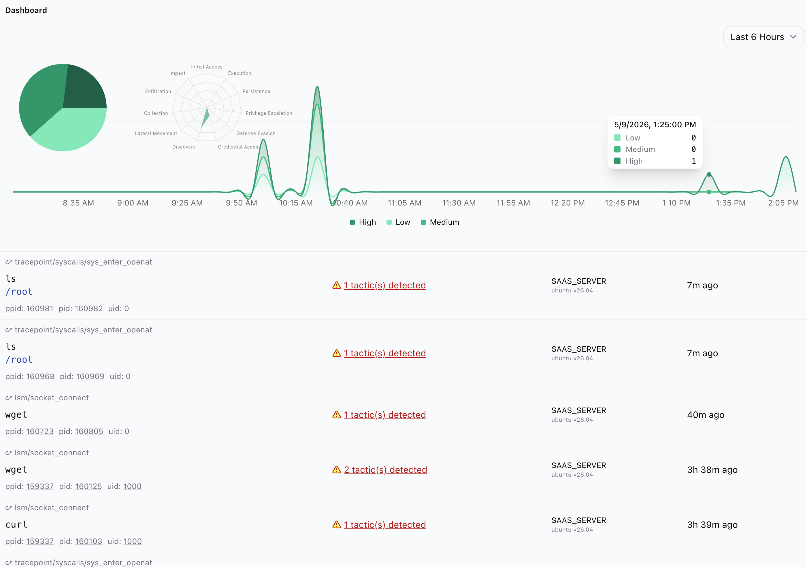
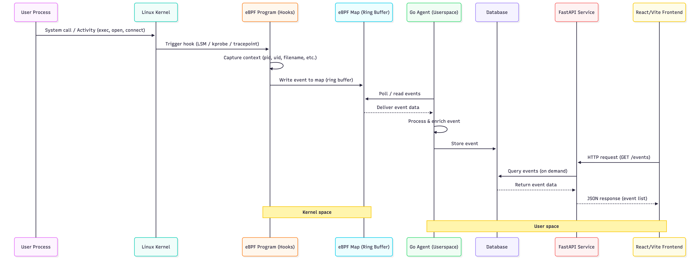

#  EDR  

Endpoint Detection and Response proof of concept for Linux. 

## Summary

This EDR PoC monitors events at the kernel level and enriches them in user-space. Detections are determined by a set of rules in `edr/intercept/user/detect/rules.go`. The rules are focused on specific toy use-cases and tie to real MITRE tactics.  

Kernel event data structure can be found in `edr/intercept/kernel/events.h`. Events are published from `tracepoint/syscalls/sys_enter_openat` and `lsm/socket_connect` hooks in the kernel and consumed + enriched by `edr/intercept/user/main.go` in user space.

Detections and events are stored in a sqlite DB, view the schema in `edr/intercept/user/db/schema.sql`. The API layer is in `edr/lattice` where detection and event data is served (including time-series data). The frontend (`perimeter`) consumes data from `lattice` by polling. It includes a pie chart, area chart, and radar chart of tactics happening in real time. Right now, only `suspicious` events are shown in the UI. 

## Architecture

This EDR is comprised of three systems:
- Intercept: an eBPF monitoring and enforcement layer that persists events in the user space
- Lattice: an API to serve event data
- Perimeter: Frontend to view and manage EDR events

Below is a simplified sequence diagram.



## Running

Target Device

```
Linux server 7.0.0-14-generic #14-Ubuntu SMP PREEMPT_DYNAMIC Mon Apr 13 10:52:31 UTC 2026 aarch64 GNU/Linux
```

Get a copy of the source code to the target device.

```bash
# clone the repo on the device you want to monitor
git clone https://github.com/sammydowds/edr.git
```

### Intercept (Kernel & User Space Agent) 

_On the target device_

Create the DB

```bash
sudo sqlite3 /var/lib/intercept/events.db < edr/intercept/user/db/schema.sql
```


Build and start the agent

```bash
cd edr/intercept && make run
```

### Lattice (Detection and Events API Layer)

On the target device:

```bash
cd edr/lattice && uv run python main.py
```

### Perimeter (Frontend)

On your dev machine:

```bash
cd edr/perimeter && npm run dev
```

NOTE: this is not a comprehensive guide to get all of the dependencies intstalled on the linux server, so you might hit more issues. For example, you will need to ensure `bpf` is enabled (see below), Go installed, uv installed, etc. 

#### Ensuring BPF LSM is enabled

```bash
cat /sys/kernel/security/lsm

--> Should ouput some list with "bpf" in it
```

If not, update Grub settings, and reboot 
```bash
sudo vim /etc/default/grub

# update below
GRUB_CMDLINE_LINUX_DEFAULT="quiet splash lsm=lockdown,capability,bpf,yama"

# then update and restart
sudo update-grub
sudo reboot
```

## Resources & Info 

### Production Systems: eBPF security/observability
- [Tetragon](https://tetragon.io/docs/)
- [Falco](https://falco.org/)
- [Tracee](https://aquasecurity.github.io/tracee/latest/)

### eBPF Learning Materials
- [eBPF](https://ebpf.io/what-is-ebpf/)
- [eBPF Ecosystem](https://ebpf.io/applications/)
- [eBPF Documentary](https://www.youtube.com/watch?v=Wb_vD3XZYOA)
- [Linux Security Modules](https://www.kernel.org/doc/html/latest/security/lsm.html#lsm-capabilities-module)
- [eBPF security run time w/ Liz Rize](https://youtu.be/maP3ceTjugk?si=174hFDhfD2kmPRhK)
- [Intro to eBPF](https://www.youtube.com/watch?v=WVy6CtDbpR4)
